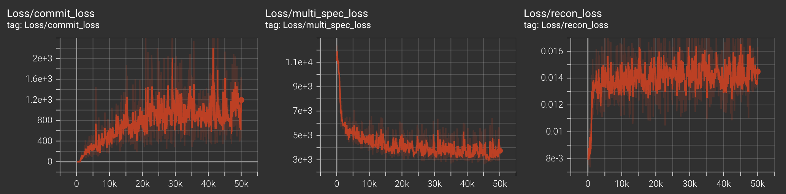
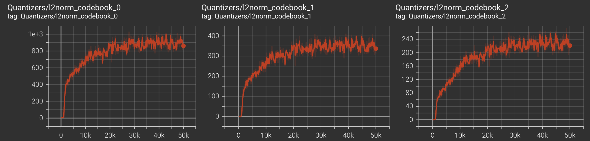
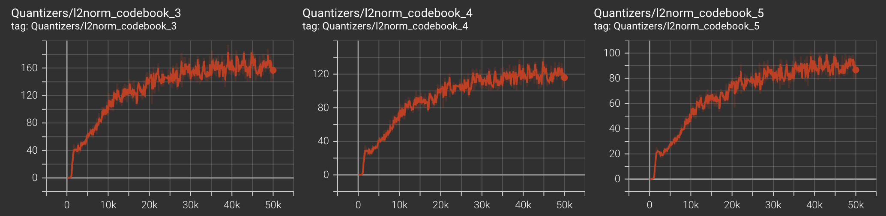
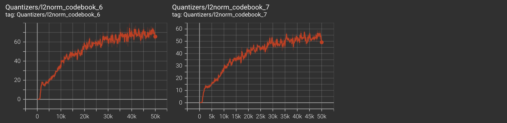
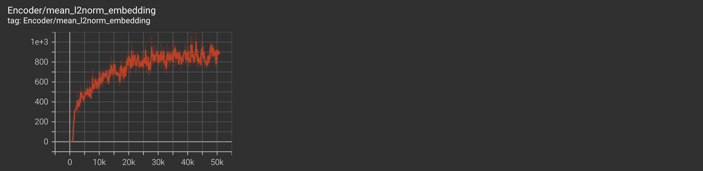
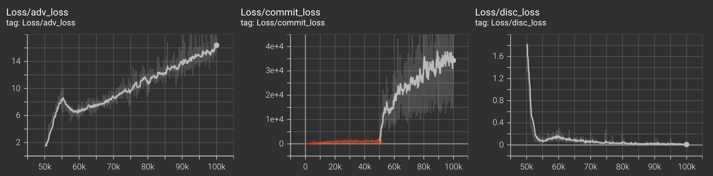
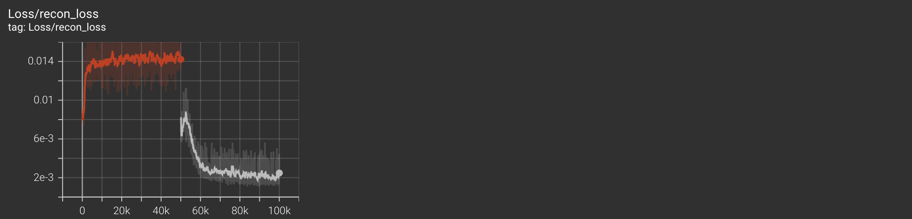
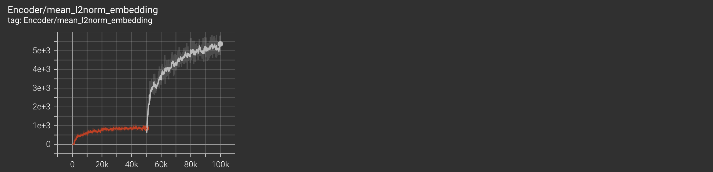

## Tensorboard Setup

Run this on the remote server:
```bash
sbatch train.sbatch # begins training
sbatch tensorboard.sbatch # begins tensorboard logging
```
Then, you can find the port we need to forward in the Report that is written to the home directory. It looks something like
```
TensorBoard 2.19.0 at http://atl1-1-02-003-19-1.pace.gatech.edu:6006/ (Press CTRL+C to quit)
```

Run this locally to set up port forwarding:
```bash
ssh -N -L localhost:16006:atl1-1-02-003-19-1.pace.gatech.edu:6006 <your-login>@login-ice.pace.gatech.edu 
```
Then go into your browser and type in `http://localhost:16006`

## Training Progress

### 🎧 Real vs. Fake Audio Samples

| Timestep | Real Audio | Fake (Generated) Audio |
|----------|------------|------------------------|
| 50k      | [🔊 Real 50k](media/real_50k.wav) | [🤖 Fake 50k](media/fake_50k.wav) |
| 80k      | [🔊 Real 80k](media/real_80k.wav) | [🤖 Fake 80k](media/fake_80k.wav) |
| 100k     | [🔊 Real 100k](media/real_100k.wav) | [🤖 Fake 100k](media/fake_100k.wav) |

### Training Curves

| Metric   |                    | 
|----------|------------------------------|
| Loss @ 50k |  |
| Quantizers @ 50k |  |
|  |  |
|  |  |
| Encoder Embeddings @ 50k |  |
| Loss @ 100k |  |
|  |   |
|  |   |
| Encoder Embeddings @ 100k |  |


