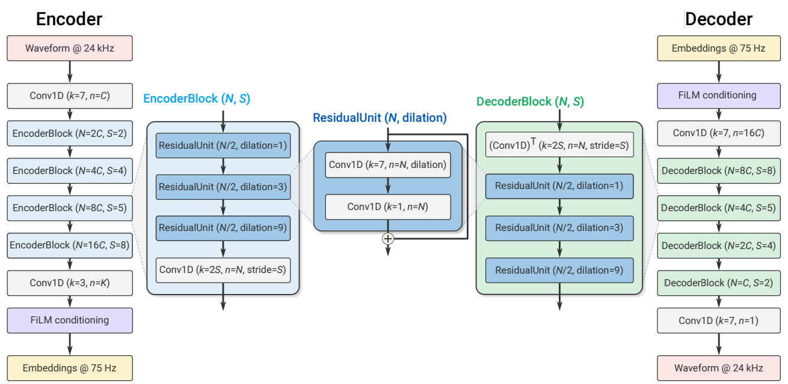

## Overview
This repository implements the Soundstream neural audio codec from scratch in pytorch, staying as true as possible to the [paper](https://arxiv.org/abs/2107.03312). We provide an implementation of the model in `model.py` and training code in `train.py`. 




## Dataset
We use the LibriTTS dataset, specifically the `train-clean-100` subset. It can be downloaded and used in pytorch with the following line:

```python
libritts_dataset = torchaudio.datasets.LIBRITTS('.', download=True)
```
## Training

Traning is done a single Nvidia L40S GPU with 8 CPU threads. 7 threads are used for dataloading.

We first did generator warmup ( by calling `generator_warmup()` in `train.py`) for 50k iterations (~ 7-8 hours). Parameters for training were

```python
batch_size=128,
max_grad_norm=0.5,      # gradients are clipped to avoid excessively large updates
warmup_steps=1000,      # number of warmup steps for linear warmup schedule
G_lr=2e-4,              # learning rate
G_betas=(0.9, 0.99),    # adam optimizer betas
rq_ema_gamma=0.95,      # vector quantizer codebook exponential moving average update gamma
use_quantizer_dropout=True, # whether to use quantizer dropout
vq_num_groups = 2,             # number of groups for grouped RVQ
C=32,                       # soundstream channel parameter
weights=(0., 0., 1.0, 1.0, 1.0), # (adversarial loss, feature loss, multi_spectral loss, reconstruction loss, commitment loss)
```

We then followed with adversarial training (`adversarial_training()` in `train.py`) for another 80k iterations (~ 4-5 hours).

```python
batch_size=16,
max_grad_norm=0.5,
G_lr=1e-4,
D_lr=1e-4,
G_betas=(0.9, 0.99),
D_betas=(0.5, 0.9),
update_D_every=1,                   # update the discriminator every ___ iterations
update_codebook_every=8,            # update the RVQ codebooks every ___ iterations
rq_ema_gamma=0.95,
use_quantizer_dropout=False,
vq_num_groups=2,
C=32,
weights=(1.0, 0.1, 0.01, 1.0, 1.0), # (adversarial loss, feature loss, multi_spectral loss, reconstruction loss, commitment loss)
```

Lastly, we dropped the feature loss weight by a factor of 10 and trained for another 70k iterations (~ 4 hours).

```python
batch_size=16,
max_grad_norm=0.5,
G_lr=1e-4,
D_lr=1e-4,
G_betas=(0.9, 0.99),
D_betas=(0.5, 0.9),
update_D_every=1,                   # update the discriminator every ___ iterations
update_codebook_every=8,            # update the RVQ codebooks every ___ iterations
rq_ema_gamma=0.95,
use_quantizer_dropout=False,
vq_num_groups=2,
C=32,
weights=(1.0, 0.01, 0.01, 1.0, 1.0), # (adversarial loss, feature loss, multi_spectral loss, reconstruction loss, commitment loss)
```

### 🎧 Real vs. Fake Audio Samples

We take 100 test samples from the `dev-clean` subset of LibriTTS for testing. We report a ViSQOL score which is calculated as the mean of MOS-LQO scores of the 100 samples. Not sure why the ViSQOL score is well below the reported number by the authors. Insights into why are welcome.

| Real Audio                        | Iteration No.|  Fake (Generated) Audio             | VISQOL|
|-----------------------------------|--------------|-------------------------------------|-------|
|[🔊 Real 50k](media/5676.wav) | 50k               |  [🤖 Fake 50k](media/5676_50k.wav)   | |
|                              | 75k               |  [🤖 Fake 75k](media/5676_75k.wav)   | |
|                              | 100k              |  [🤖 Fake 100k](media/5676_100k.wav) | |
|                              | 130k              |  [🤖 Fake 100k](media/5676_130k.wav) | |
|                              | 200k              |  [🤖 Fake 100k](media/5676_200k.wav) | |

### Training Curves

For codebook diversity metric, score of 1 implies codebooks are used uniformly (GOOD). Score of 0 implies only one codebook vector is being used (BAD).

| Metric   |                    | 
|----------|------------------------------|
| Loss  |  |
|       |  |
| Encoder Embeddings L2 Norm|  |
| Codebook Diversity |   |
|                    |   |
|                    |   |
| Codebook Mean L2 Norm | |
|                       | |


### Training Tips

- ensure that the product of `batch_size` and `update_codebook_every` is equal to 128. Anything less than this and we experience the encoder embeddings explode as training progresses.
- the feature loss weight and multispec loss weight should be dynamically adjusted. In practice, if you see a declining multi_spec_loss, this leads to better sounding audio, even at the expense of feature loss. That is why we reduced the feature loss weight by a factor of 10 at iteration number 130k.

### Checkpoints
We include two checkpoints that we found during training and had the smallest value of the multi_spec_loss. We also include 50k, 130k, and 200k checkpoints.

