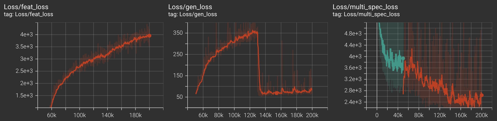

## Training Progress

### 🎧 Real vs. Fake Audio Samples

| Timestep | Real Audio | Fake (Generated) Audio |
|----------|------------|------------------------|
| 50k      | [🔊 Real 50k](media/real_50k.wav) | [🤖 Fake 50k](media/fake_50k.wav) |
| 80k      | [🔊 Real 80k](media/real_80k.wav) | [🤖 Fake 80k](media/fake_80k.wav) |
| 100k     | [🔊 Real 100k](media/real_100k.wav) | [🤖 Fake 100k](media/fake_100k.wav) |

### Training Curves

For codebook diversity metric, score of 1 implies codebooks are used unformly (GOOD). Score of 0 implies only one codebook vector is being used (BAD).

| Metric   |                    | 
|----------|------------------------------|
| Loss  |  |
|       |  |
| Encoder Embeddings L2 Norm|  |
| Codebook Diversity |   |
|                    |   |
|                    |   |

