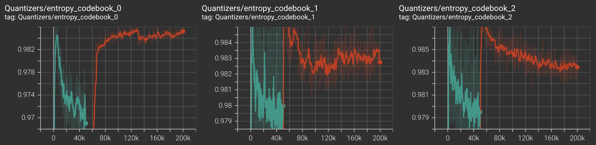
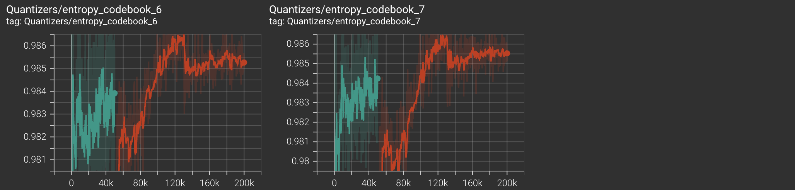
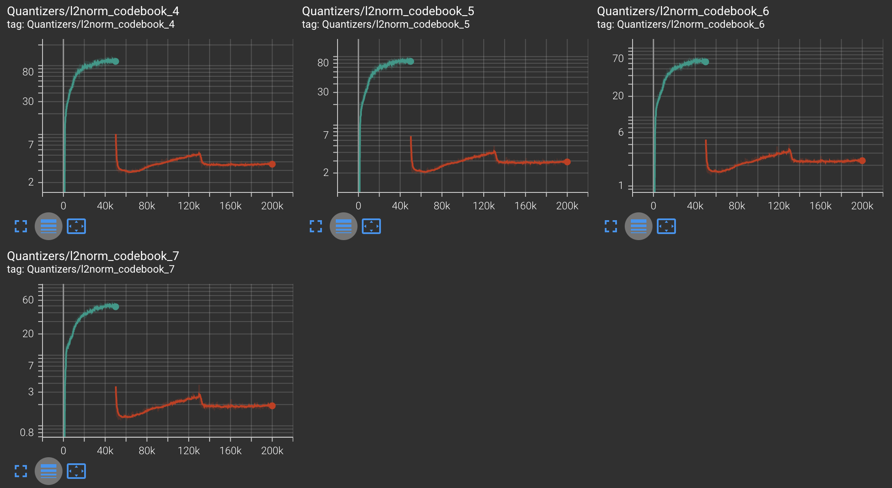

## Dataset
We use LibriTTS dataset, specifically with `train-clean-100` subset. It can be downloaded and used in pytorch with the following line:

```python
libritts_dataset = torchaudio.datasets.LIBRITTS('.', download=True)
```
## Training

Traning is done a single Nvidia L40S GPU with 8 CPU threads. 7 threads are used for dataloading.

We first did generator warmup ( by calling `generator_warmup()` in `train.py`) for 50k iterations. Parameters for training were

```python
batch_size=128,
max_grad_norm=0.5,      # gradients are clipped to avoid excessively large updates
warmup_steps=1000,      # number of warmup steps for linear warmup schedule
G_lr=2e-4,              # learning rate
G_betas=(0.9, 0.99),    # adam optimizer betas
rq_ema_gamma=0.95,      # vector quantizer codebook exponential moving average update gamma
use_quantizer_dropout=True, # wheter to use quantizer dropout
C=32,                       # soundstream channel parameter
weights=(0., 0., 1.0, 1.0, 1.0), # (adversarial loss, feature loss, multi_spectral loss, reconstruction loss, commitment loss)
```

We then followed with adversarial training (`adversarial_training()` in `train.py`) for another 50k iterations (~ 2-3 hours).

```python
batch_size=16,
max_grad_norm=0.5,
G_lr=1e-4,
D_lr=1e-4,
G_betas=(0.9, 0.99),
D_betas=(0.5, 0.9),
update_D_every=1,
update_codebook_every=8,
rq_ema_gamma=0.95,
use_quantizer_dropout=True,
C=32,
weights=(1.0, 0.1, 0.01, 1.0, 1.0), # (adversarial loss, feature loss, multi_spectral loss, reconstruction loss, commitment loss)
```

### 🎧 Real vs. Fake Audio Samples

We take 100 samples from the `dev-clean` subset of LibriTTS for testing. We report a ViSQOL score of 2.40 which is well below the numbers reported in the original soundstream paper. Not sure why. Suggestions welcome.

| Real Audio | Iteration No. |  Fake (Generated) Audio |
|----------|------------|------------------------|
|[🔊 Real 50k](media/5289.wav) | 50k      |  [🤖 Fake 50k](media/5289_50k.wav) |
|| 80k      |  [🤖 Fake 80k](media/5289_80k.wav) |
|| 100k     |  [🤖 Fake 100k](media/5289_100k.wav) |

### Training Curves

For codebook diversity metric, score of 1 implies codebooks are used uniformly (GOOD). Score of 0 implies only one codebook vector is being used (BAD).

| Metric   |                    | 
|----------|------------------------------|
| Loss  |  |
|       |  |
| Encoder Embeddings L2 Norm|  |
| Codebook Diversity |   |
|                    |   |
|                    |   |
| Codebook Mean L2 Norm | |
|                       | |


### Training Tips

- ensure that the product of `batch_size` and `update_codebook_every` is equal to 128. Anything less than this and we experience the encoder embeddings explode as training progresses.

