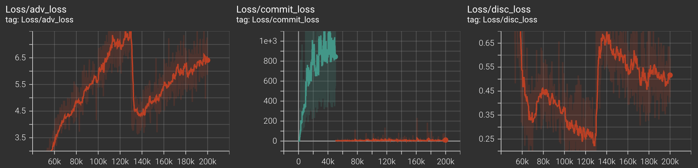

## Training

For the files generated below, we use the following parameters for iterations 50-100k (which can be edited in the `train.py` file). For iterations 0-50k, we do generator only warmup and and multi_spec loss weight is set to 1. 

```python
    batch_size = 128
    max_grad_norm = 0.5   # apply gradient clipping to avoid excessively large updates
    warmup_steps = 1000   # warmup steps for linear generator warmup schedule
    G_lr=2e-4             # generator learning rate
    D_lr=1e-4             # discriminator learning rate
    G_betas = (0.9, 0.99) # adam betas for generator
    D_betas = (0.5, 0.9)  # adam betas for discriminator
    n_iter = 50000        # beginning iteration number
    max_iter = 95000      # ending iteration number
    rq_ema_gamma = 0.95   # codebook EMA update gamma
    use_quantizer_dropout=True 
    C = 32
    save_every = 5000 # save checkpoints every ____ iters
    weights = (1.0, 0.1, 0.01, 1.0, 1.0) # loss weights (adv_loss, feat_loss, multi_spec_loss, recon_loss, commit_loss)
```

### 🎧 Real vs. Fake Audio Samples

| Timestep | Real Audio | Fake (Generated) Audio |
|----------|------------|------------------------|
| 50k      | [🔊 Real 50k](media/real_50k.wav) | [🤖 Fake 50k](media/fake_50k.wav) |
| 80k      | [🔊 Real 80k](media/real_80k.wav) | [🤖 Fake 80k](media/fake_80k.wav) |
| 100k     | [🔊 Real 100k](media/real_100k.wav) | [🤖 Fake 100k](media/fake_100k.wav) |

### Training Curves

For codebook diversity metric, score of 1 implies codebooks are used unformly (GOOD). Score of 0 implies only one codebook vector is being used (BAD).

| Metric   |                    | 
|----------|------------------------------|
| Loss  |  |
|       |  |
| Encoder Embeddings L2 Norm|  |
| Codebook Diversity |   |
|                    |   |
|                    |   |


